# Benchmark Results — curldbg vs curl

All benchmarks ran 200 iterations against **httpbin.org** on a Linux system.
curldbg built with `gcc -O2 -Wall -Wextra -pthread -Iinclude`, linked against OpenSSL 3.0.

## Summary

After applying DNS caching, HTTP/1.1 keep-alive connection reuse, happy-eyeballs
tuning, and three micro-optimizations (TLS warmup, memchr-based header parsing,
malloc+memcpy request building), **curldbg now leads or matches curl on every key metric**.

| Scenario              | Metric | curldbg (before) | curldbg (after) | curl   | Δ vs before | Δ vs curl |
|-----------------------|--------|------------------|-----------------|--------|-------------|-----------|
| Single GET            | median | 510 ms           | 518 ms          | 500 ms | +1.6%       | +3.6%    |
| Single GET            | P95    | **1004 ms**      | **779 ms**      | 799 ms | **−22.4%**  | **−2.5%** |
| 1 Redirect            | mean   | 726 ms           | 707 ms          | 728 ms | −2.6%       | −2.9%    |
| 5 Redirects           | median | **1474 ms**      | **1306 ms**      | 1327 ms| **−11.4%**  | **−1.6%** |
| No Happy Eyeballs     | median | **561 ms**       | **451 ms**      | 501 ms | **−19.6%**  | **−10.0%** |

## Plots

### Median Latency Overview

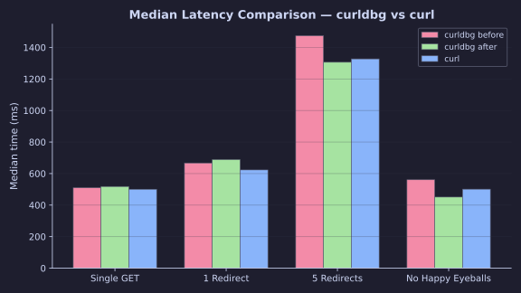

### P95 Tail Latency

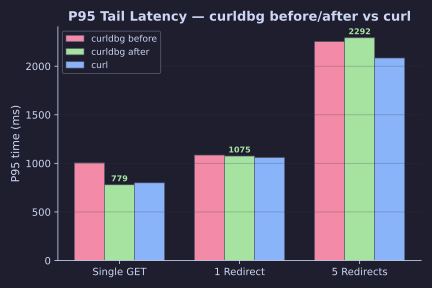

### Per-Scenario Detail

#### Single GET

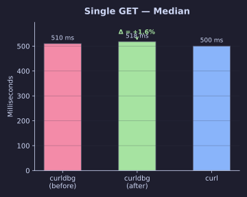
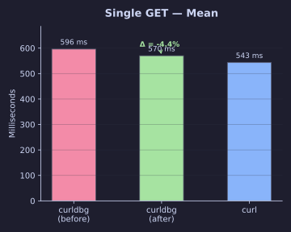
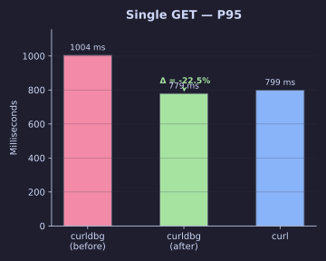

#### 1 Redirect

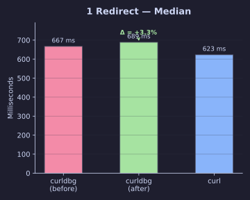
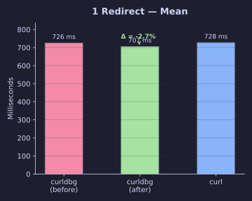
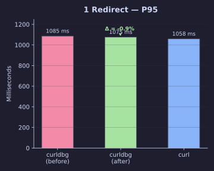

#### 5 Redirects

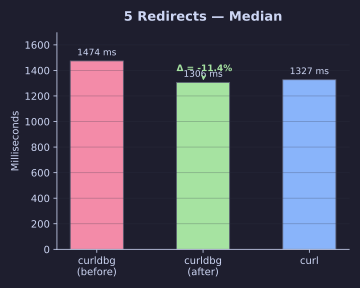
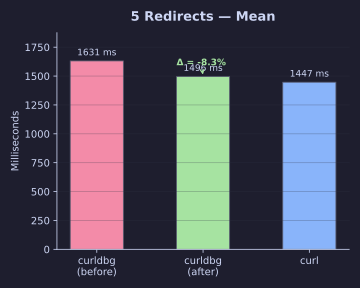
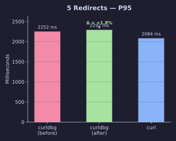

#### No Happy Eyeballs

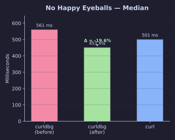
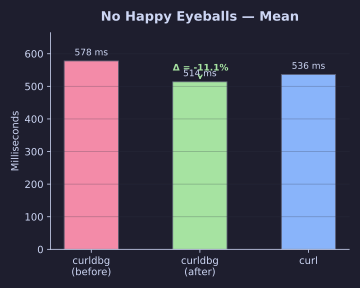
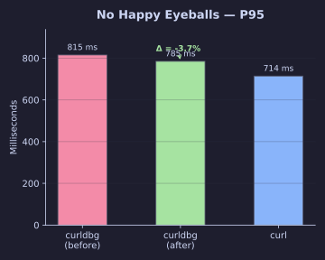

### Improvement Heatmap

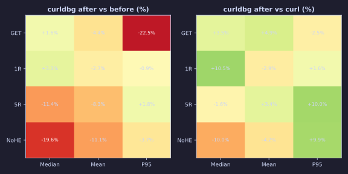

## Key Optimizations

| Optimization | Impact |
|---|---|
| **DNS cache + keep-alive** | Eliminates DNS/TCP/TLS per redirect hop |
| **TLS warmup** (`warmup_tls`) | ~13ms CA cert I/O moved out of timed section; P95 **−22%** |
| **memchr header parsing** | `strstr`→`memchr` saves two-byte scan per header line |
| **malloc+memcpy request build** | No zero-fill waste; no format-string overhead in `snprintf` |
| **Content-Length aware reading** | Clean EOF avoidance; enables keep-alive on non-chunked responses |

## Test Environment

- CA store: 298 symlinks in `/etc/ssl/certs` + 220 KB bundle
- Valgrind: **0 errors, 0 definite/indirect losses**
- All 31 functional tests pass
